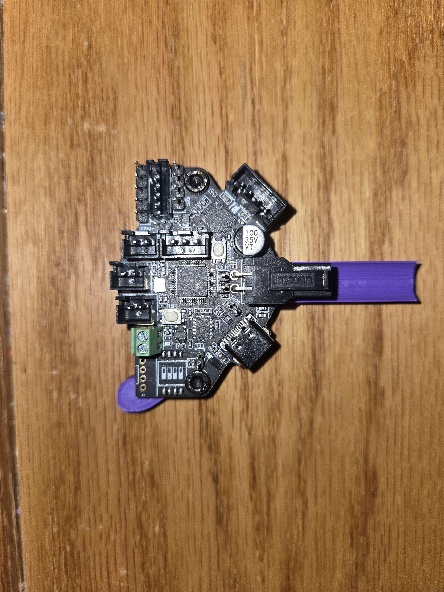
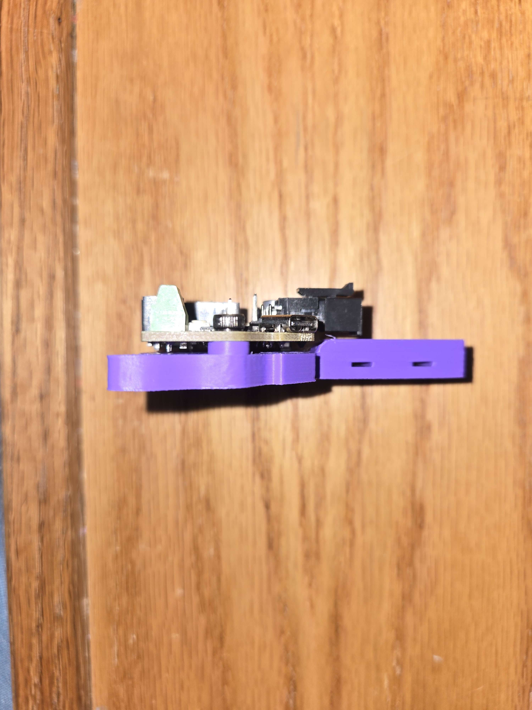
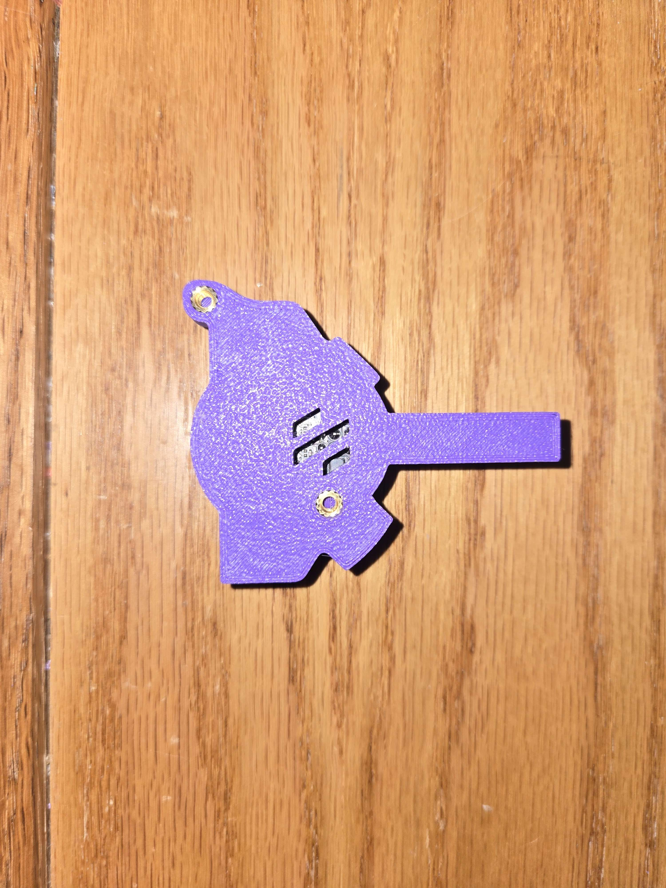

# EBB36 and Galileo 2 Standalone User Mod

## Overview

This user mod provides compatibility between the [EBB36](https://example.com/ebb36) and the [Galileo 2 Standalone](https://github.com/JaredC01/Galileo2/tree/main/galileo2_standalone) system. The mod enables seamless integration, allowing users to utilize these two components together efficiently.

*Image of the EBB36 device*

  
*Image of the Galileo 2 Standalone system*

## Features

- **Compatibility**: Ensures that the EBB36 can communicate effectively with the Galileo 2 Standalone.
- **Ease of Use**: Simplifies the pairing process with user-friendly instructions.
- **Enhanced Functionality**: Leverages the combined capabilities of both devices for improved performance.

## Installation

### Prerequisites

Before installing the mod, ensure you have the following:
- EBB36 device.
- Galileo 2 Standalone system (available [here](https://github.com/JaredC01/Galileo2/tree/main/galileo2_standalone)).
- Basic understanding of firmware updates and device connections.

### Steps

1. **Download the Mod**: Obtain the latest version of the user mod from the [releases page](https://example.com/releases).

2. **Update Firmware**:
   - Ensure your EBB36 has the latest firmware compatible with the Galileo 2 Standalone. Follow the [EBB36 firmware update guide](https://example.com/ebb36-firmware-guide) for detailed instructions.
   -   
     *Example of the firmware update process*

3. **Connect Devices**:
   - Connect the EBB36 to the Galileo 2 Standalone using the appropriate cables. Refer to the [Galileo 2 Standalone documentation](https://github.com/JaredC01/Galileo2/tree/main/galileo2_standalone) for connection details.
   -   
     *Diagram of the device connections*

4. **Apply the Mod**:
   - Follow the instructions provided in the mod package to apply the changes. Typically, this involves uploading configuration files or scripts to the Galileo 2 Standalone.
   -   
     *Screenshot of applying the mod*

5. **Verify Installation**:
   - Power on both devices and verify that they are communicating correctly. You can use diagnostic tools provided in the Galileo 2 Standalone documentation to check the connection status.
   -   
     *Example of the verification screen*

## Configuration

After installation, you may need to configure the devices to suit your specific needs. Configuration options include:

- **Device Settings**: Adjust settings on the EBB36 and Galileo 2 Standalone for optimal performance.
- **Communication Parameters**: Set parameters such as baud rate and protocol to ensure compatibility.

Refer to the [Galileo 2 Standalone configuration guide](https://github.com/JaredC01/Galileo2/tree/main/galileo2_standalone) for detailed configuration instructions.
-   
  *Example of configuration settings*

## Troubleshooting

If you encounter issues, consider the following steps:

- **Check Connections**: Ensure all cables are securely connected.
- **Verify Firmware Versions**: Ensure both devices have compatible firmware versions.
- **Consult Documentation**: Refer to the [EBB36 troubleshooting guide](https://example.com/ebb36-troubleshooting) and the [Galileo 2 Standalone FAQ](https://github.com/JaredC01/Galileo2/tree/main/galileo2_standalone) for common issues and solutions.
-   
  *Common troubleshooting steps*

## Contributing

If you have suggestions for improvements or encounter bugs, please open an issue on the [GitHub repository](https://example.com/issues). Contributions are welcome, and you can submit a pull request to enhance the mod.

## License

This mod is licensed under the [MIT License](https://example.com/license). See the `LICENSE` file for more details.

## Contact

For further assistance, you can contact the mod author at [email@example.com](mailto:email@example.com).

---

Thank you for using the EBB36 and Galileo 2 Standalone User Mod. We hope it enhances your experience with these devices!

